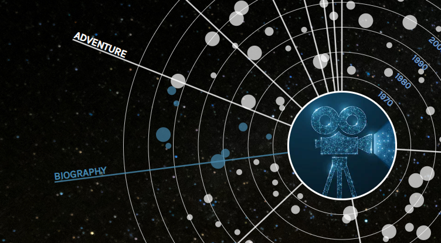

# Women Impact in the Movie Universe
This visualization display bechdel data of the 100 highest rated movies on IMDb. The movies are classified and visualized according to their primary genre. The project was conducted as part of the course 'Information Visualization, TNM048' at Linköping University and implemented under the duration of 4 weeks. The aim of the visualization is to investigate if there is a connection between movie genre and the amount of movies passing the Bechdel test. 

## Data
The data is collected from <a href="https://www.kaggle.com/carolzhangdc/imdb-5000-movie-dataset">the 5000 movie dataset from IMDb</a> at Kaggle and the <a href="https://data.world/fivethirtyeight/bechdel">Bechdel data set</a>. 

## Data Mining
The data has been processed with the use of two data mining techniques, dimensional reduction and pattern recognition. The data mining is performed with a Python script and the output of the script gives statistics of the data being processed. A delimitation of the data mining is that for movies with multiple genres, only the primary genre is chosen. 

## Visualization highlights
The main part of the visualization is to give an overview of the multivariate data. The circles are used as a way to map the year of production of the movie and the movies are represented as circles that have a size depending on the gross income of the movie in US dollars. The core of the visualization is built with regards to the 'Visualization Seeking Mantra' that is; overview, filtering and details on demand. 

# Filtering
The filtering are given to the user as a way to display which movie that are passing, which are not and those who do not have any data to display. When the filtering button are active, the corresponding movies are highlighted in the visualization. 

# Details when hovering on a movie
To give details on demand, a legend is displayed when hovering over a moviie circle in the visualization. The middle image is replaced by the poster image of that movie and some additional information such as title, production year, genre and bechdel data are displayed in a legend. 

# Details when hovering on the genre
Each pie chart piece of the visualization is corresponding to a different genre and the circles in that piece are corresponding to that genre. When hovering over the name of the genre, all the movies that have that genre are highlighted. 

## Conclusion and further work
The movie industry still suffers from very few movies passing the Bechdel test, there can be found especially low rates of passing movies within the action genre. In addition to the current display of movies, we are interested in extending the visualization with the possibility to investigate how the influence of female writers and producers are affecting the movies probability to pass the Bechdel test. 

## Attributions
The inspiration for the visualization is based on the <a href="http://www.benscott.co.uk/wdvp/">World of Happiness</a> visualization by Ben Scott and the approach of sunburst with year rings comes from inspiration of <a href="https://observablehq.com/@mksrivastava/d3-starburst-from-sunburst">d3 starburst-from-sunburst</a> by Manish Kumar Srivastava. 
